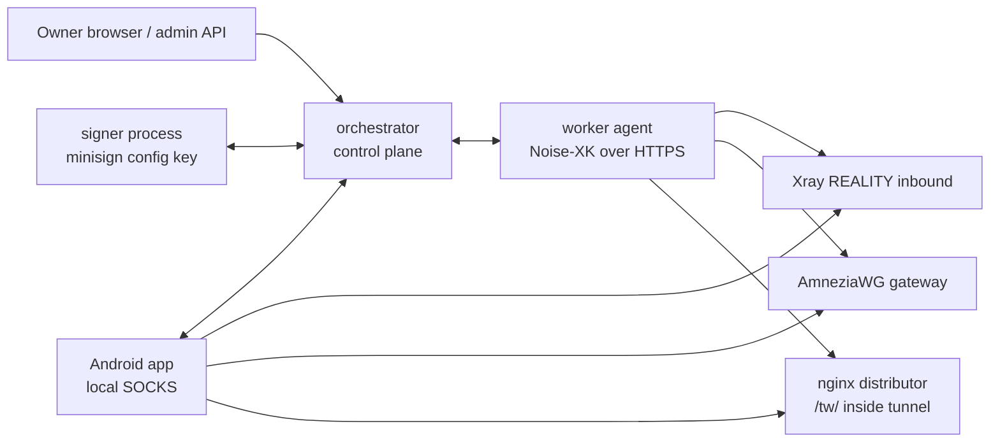
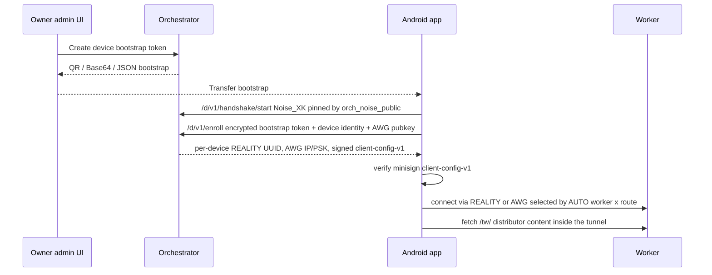

# TrafficWrapper Architecture

This document describes the public self-hosted TrafficWrapper platform. The
orchestrator repository is the canonical entry point; worker and app repositories
contain component-specific notes that link back here.

## Components

- `orchestrator/cmd/orchestrator/main.go` owns the HTTP API, admin UI, worker
  approval, device enrollment, bundle generation, and APK publication metadata.
- `orchestrator/cmd/orchestrator/signer.go` isolates the config-signing minisign
  key behind `ORCH_SIGNER_SOCKET`.
- `orchestrator/internal/protocol/protocol.go` defines the Noise envelope:
  prologue `TrafficWrapper orchestrator worker v1`, Noise_XK, DH25519,
  ChaChaPoly, SHA256, and framed encrypted JSON.
- `worker/agent/cmd/agent/orch_client.go` enrolls, pulls config, long-polls
  nudges, acknowledges applied state, and forwards telemetry.
- `worker/agent/cmd/agent/materialize.go` turns approved devices into per-device
  Xray REALITY clients and AmneziaWG peers.
- `worker/core/transport/public_platform.go` and `app/core/transport` contain
  shared public-platform transport helpers used by worker/app code.
- `app/client/app/src/main/java/...` imports bootstrap payloads, verifies signed
  client config, starts local SOCKS routing, and selects worker by route.

## Trust and Bundles

The orchestrator creates two signed bundles from one owner-controlled state:

- `worker-config-v1` is private to workers. It contains desired state such as
  approved devices, per-device REALITY UUIDs, AWG public keys, internal IPs, and
  update metadata needed by the worker agent.
- `client-config-v1` is public to enrolled devices. It contains approved active
  workers, routes, transport parameters, and update/distributor metadata.

Both bundles are signed by the signer process. The signer signs the exact
`config_json` string; consumers verify that string with minisign before parsing
or applying it. The signer private key is not held by the web/admin process.

## Worker Enrollment

1. The owner creates a one-time `ENROLL_TOKEN`.
2. The worker starts with `ORCH_URL`, `ORCH_STATIC_PUBLIC_KEY`, `ENROLL_TOKEN`,
   a generated worker Noise static key, a generated AWG dialect, and a real
   `CAMOUFLAGE_DOMAIN`.
3. The worker opens `/w/v1/handshake/start`, pins the orchestrator static Noise
   key, and completes Noise_XK over HTTPS.
4. The encrypted `/w/v1/enroll` request sends the token, worker static public
   key, and self-description.
5. The orchestrator records the worker as pending. The owner approves it in the
   admin UI or API.
6. After approval, `/w/v1/config/pull` returns signed worker/client bundles.
   The worker verifies minisign, materializes local Xray/AWG state, and sends
   `/w/v1/ack`.

## Device Enrollment and Connect

The first bootstrap is one-time and pre-approved by the owner. The app confirms
the parsed `orchestrator_url` and `config_pubkey_pin` before enrollment. After
enrollment, the app verifies signed `client-config-v1`, creates per-device
REALITY/AWG credentials, starts a local SOCKS front-end, and automatically probes
worker x route candidates. The active route is chosen by observed health and
policy; AWG remains a fallback path when REALITY is unhealthy.

## Distributor and Updates

Workers expose the nginx distributor only inside the tunnel at `/tw/`. It serves
client config, APK update artifacts, and telemetry forwarding paths to enrolled
clients. Public clearnet distribution is intentionally avoided so deployment
metadata is not advertised by a generic web endpoint.

APK trust is separate from config trust:

- Android verifies APK package signatures against the pinned signing certificate
  fingerprint.
- The app verifies update manifests with the deployment update minisign public
  key.
- Client config is verified with the config-signing minisign key pinned through
  bootstrap/enrollment.

## Production Notes

Every deployment should generate unique worker state, AWG dialects, Noise static
keys, config-signing keys, update keys, and camouflage values. Public examples
such as `example.com` or seed update keys are for local demos only.
