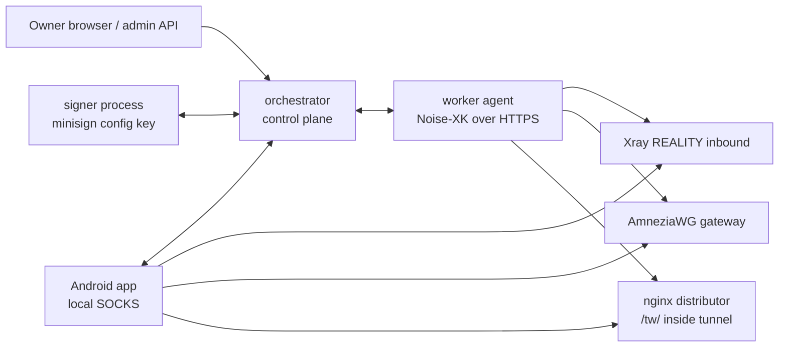
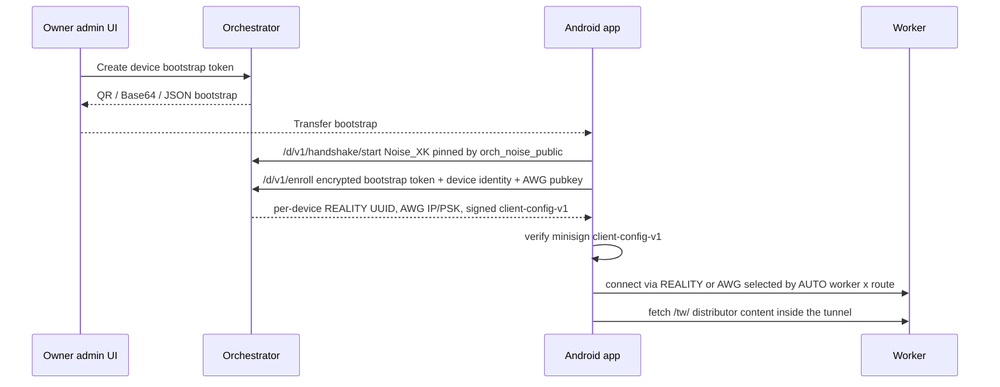

# TrafficWrapper Architecture

[Русский](ARCHITECTURE.ru.md)

This document describes the public self-hosted TrafficWrapper platform. The
orchestrator repository is the canonical entry point; worker and app repositories
contain component-specific notes that link back here.

## Components

```mermaid
flowchart LR
  Owner[Owner browser / admin API] --> ORCH[orchestrator\ncontrol plane]
  Signer[signer process\nminisign config key] <--> ORCH
  ORCH <--> WorkerAgent[worker agent\nNoise-XK over HTTPS]
  WorkerAgent --> Xray[Xray REALITY inbound]
  WorkerAgent --> AWG[AmneziaWG gateway]
  WorkerAgent --> Dist[nginx distributor\n/tw/ inside tunnel]
  Android[Android app\nlocal SOCKS] <--> ORCH
  Android --> Xray
  Android --> AWG
  Android --> Dist
```

- `orchestrator/cmd/orchestrator/` holds the control plane, split by concern:
  `main.go` (config, commands), `serve.go` (HTTP server and routes),
  `noise_transport.go` (Noise handshakes and envelopes), `worker_api.go` and
  `device_api.go` (enroll/pull/ack), `bundles.go` (signed worker/client
  config), `telemetry.go`, `admin_auth.go` and `admin_api.go` (admin UI/API),
  `apk_release.go` (APK publication), `store.go` (bbolt state), `cli.go`.
- `orchestrator/cmd/orchestrator/signer.go` isolates the config-signing minisign
  key behind `ORCH_SIGNER_SOCKET`.
- `orchestrator/internal/protocol/protocol.go` defines the Noise envelope:
  prologue `TrafficWrapper orchestrator worker v1`, Noise_XK, DH25519,
  ChaChaPoly, SHA256, and framed encrypted JSON.
- `worker/agent/cmd/agent/orch_client.go` enrolls, pulls config, long-polls
  nudges, acknowledges applied state, and forwards telemetry.
- `worker/agent/cmd/agent/materialize.go` turns approved devices into per-device
  Xray REALITY clients and AmneziaWG peers.
- `worker/core/transport/public_platform.go` and `app/core/transport` contain
  shared public-platform transport helpers used by worker/app code.
- `app/client/app/src/main/java/...` imports bootstrap payloads, verifies signed
  client config, starts local SOCKS routing, and selects worker by route.

## Trust and Bundles

The orchestrator creates two signed bundles from one owner-controlled state:

- `worker-config-v1` is private to workers. It contains desired state such as
  approved devices, per-device REALITY UUIDs, AWG public keys, internal IPs, and
  update metadata needed by the worker agent.
- `client-config-v1` is public to enrolled devices. It contains approved active
  workers, routes, transport parameters, and update/distributor metadata.

Both bundles are signed by the signer process. The signer signs the exact
`config_json` string; consumers verify that string with minisign before parsing
or applying it. The signer private key is not held by the web/admin process.

## Worker Enrollment

1. The owner creates a one-time `ENROLL_TOKEN`.
2. The worker starts with `ORCH_URL`, `ORCH_STATIC_PUBLIC_KEY`, `ENROLL_TOKEN`,
   a generated worker Noise static key, a generated AWG dialect, and a real
   `CAMOUFLAGE_DOMAIN`.
3. The worker opens `/w/v1/handshake/start`, pins the orchestrator static Noise
   key, and completes Noise_XK over HTTPS.
4. The encrypted `/w/v1/enroll` request sends the token, worker static public
   key, and self-description.
5. The orchestrator records the worker as pending. The owner approves it in the
   admin UI or API.
6. After approval, `/w/v1/config/pull` returns signed worker/client bundles.
   The worker verifies minisign, materializes local Xray/AWG state, and sends
   `/w/v1/ack`.

## Worker self_describe contract

Everything a worker reports in `self_describe` is untrusted. It is sanitized
once on intake (enroll, nudge, ack) and only the sanitized copy is stored:

- Allowed top-level keys: `schema`, `hostname`, `egress_ip`, `orch_url`,
  `agent_url`, `distributor_url`, `standalone`, `dialect_id`, `capacity`,
  `protocols`, `reality`, `reality_profiles`, `awg`, `awg_profiles`, `health`,
  `orchestrator`, `distributed_apk`, `capabilities`. Unknown keys are dropped
  without rejecting the worker. `priority`, `weight`, `label` and `region` are
  operator policy and never taken from a worker (defaults 10/100).
- Limits: strings up to 256 bytes, up to 32 profiles per list, 64 KiB in total
  (a larger report is ignored and the previous one stays in effect).
- REALITY keys must be 32-byte base64 (RawURL or padded), AWG keys 32-byte
  standard base64, ports 1..65535, addresses a hostname or IP. A malformed
  field is kept and raises an alert rather than silently dropping a route.
- A secret-looking key (`private_key`, `psk2`, `internal_ip`, ...) anywhere is
  stripped and keeps that worker out of client bundles and discovery until it
  reports a clean description; other workers are unaffected. Client bundles
  are validated per worker, and routes without `type`, `address` and `port` or
  carrying `discovery_url(s)` are not published.
- AWG profiles for device credentials are the union over approved, enabled
  workers; for each profile the subnet most workers agree on wins. A worker
  whose subnet differs (or is not a private /16../26 pool) keeps its AWG out
  of client bundles and raises an alert.
- Handshake budget. Anonymous handshakes share a per-address (/32, IPv6
  /64) and per-network (/24, IPv6 /56) pending pool. After any authenticated
  `/w/` call an approved worker gets `cookie` in the (plaintext) Noise
  envelope response: `v1.<worker_id>.<expiry_unix>.<mac>`, valid for 1 hour.
  Sending it back as `cookie` in the next `POST /w/v1/handshake/start` body
  puts the handshake in a reserved worker pool (per-worker limits), so a flood
  from many networks cannot lock workers out. Workers that never send it keep
  using the shared pool. The cookie grants no authentication; the Noise
  handshake still does that. Before any authentication the server also caps
  open connections (8192), header size (64 KiB) and concurrent buffered
  request bodies (512).
- Client bundle seq. The shared client bundle (the same for enrollment and
  pull) is published with a persistent, strictly increasing seq: one seq is
  always one content (only `issued_at`/`expires_at` are re-signed, at most
  once a minute). A content change is published under seq+1 after two
  identical checks 5 s apart (operator actions publish on the next check);
  content older than 2/3 of `ORCH_CLIENT_BUNDLE_TTL` is republished under
  seq+1. Workers get their config seq raised to at least the client seq on
  every publish. `workers` is always an array; enrollment with no worker
  available fails with a retryable "no approved worker" error before the
  token is spent. Workers may report `client_applied_seq` in ack.
- Refusal codes and platform time. Refusals keep their error texts (older
  apps and workers match them) and add `code`: on `/d/v1/enroll`
  token_invalid, device_not_approved, device_revoked, identity_mismatch,
  noise_mismatch, awg_key_mismatch, no_worker, retry; on `/w/v1/telemetry`
  stale_timestamp, replay, bad_signature, unknown_device,
  device_not_approved, invalid_payload, worker_revoked, worker_pending.
  Every worker-facing Noise response carries `server_time` (orchestrator
  clock, unix ms). The enroll response always carries `reality_flow`, also
  when empty.

## Device Enrollment and Connect

```mermaid
sequenceDiagram
  participant Owner as Owner admin UI
  participant O as Orchestrator
  participant A as Android app
  participant W as Worker
  Owner->>O: Create device bootstrap token
  O-->>Owner: QR / Base64 / JSON bootstrap
  Owner-->>A: Transfer bootstrap
  A->>O: /d/v1/handshake/start Noise_XK pinned by orch_noise_public
  A->>O: /d/v1/enroll encrypted bootstrap token + device identity + AWG pubkey
  O-->>A: per-device REALITY UUID, AWG IP/PSK, signed client-config-v1
  A->>A: verify minisign client-config-v1
  A->>W: connect via REALITY or AWG selected by AUTO worker x route
  A->>W: fetch /tw/ distributor content inside the tunnel
```

The first bootstrap is one-time and pre-approved by the owner. The app confirms
the parsed `orchestrator_url` and `config_pubkey_pin` before enrollment. After
enrollment, the app verifies signed `client-config-v1`, creates per-device
REALITY/AWG credentials, starts a local SOCKS front-end, and automatically probes
worker x route candidates. The active route is chosen by observed health and
policy; AWG remains a fallback path when REALITY is unhealthy.

## REALITY Vision, Short ID Cohorts and AWG Rotation

- **Vision (per device).** The app lists `client_capabilities: ["reality_vision", ...]` (alias `capabilities`) in
  `/d/v1/enroll`; the orchestrator then stores `reality_flow =
  "xtls-rprx-vision"` for the device, returns it in the enroll response and
  sends it to workers in `desired_state.approved_devices[].reality_flow`.
  Re-enrolling without the capability clears it. The shared client bundle never
  carries a flow: the app must apply the enroll-response `reality_flow` to TCP
  REALITY routes (XHTTP routes never use a flow), because Xray rejects a client
  whose flow differs from its account.
- **Short ID cohorts.** Workers publish `reality.cohort_short_ids`; client
  bundle REALITY routes carry the list (also in `params`) with revoked slots
  blanked (`""`) so positions never shift. The app uses slot
  `uint32be(sha256(device_id)[0:4]) % len(list)`, falling back to `short_id`
  when the slot is blank. `POST /admin/v1/workers/short-id
  {id, short_id, revoked}` fills `desired_state.revoked_short_ids`. The admin
  device list shows each device's `reality_cohort` slot.
- **Fallback profiles.** With `ORCH_REALITY_FALLBACK_PROFILES=1`, the
  other `reality_profiles` (XHTTP, or TCP on another port) are added as extra
  REALITY routes right after a worker's primary route. No flow is sent; each
  REALITY route carries `vision` (true when the profile's `flows` include
  `xtls-rprx-vision`), and the app applies its `reality_flow` only there. Off by default: the app fills only two
  REALITY slots, so fallbacks displace a second worker's REALITY route.
- **AWG dialect rotation.** `POST /admin/v1/workers/awg-drain {id, profile,
  draining}` stops offering an AWG profile to clients (devices keep
  credentials for every profile), so they move to the worker's other profile
  before the old one is removed.
- **Health and limits.** Ack `self_check` (`ok` / `degraded: ...`) and
  self-describe `health` are shown in the admin UI/API; the Telegram bot alerts
  on degraded workers. Device limits sent to workers include
  `download_mbps`/`upload_mbps` (whole Mbit/s, rounded up, max 100000; the
  worker shapes AWG only) derived from the rate limit text (`20mbit`, `1gbit`).

## Distributor and Updates

Workers expose the nginx distributor only inside the tunnel at `/tw/`. It serves
client config, APK update artifacts, and telemetry forwarding paths to enrolled
clients. Public clearnet distribution is intentionally avoided so deployment
metadata is not advertised by a generic web endpoint.

APK trust is separate from config trust:

- Android verifies APK package signatures against the pinned signing certificate
  fingerprint.
- The app verifies update manifests with the deployment update minisign public
  key.
- Client config is verified with the config-signing minisign key pinned through
  bootstrap/enrollment.

## Production Notes

Every deployment should generate unique worker state, AWG dialects, Noise static
keys, config-signing keys, update keys, and camouflage values. Public examples
such as `example.com` or seed update keys are for local demos only.
