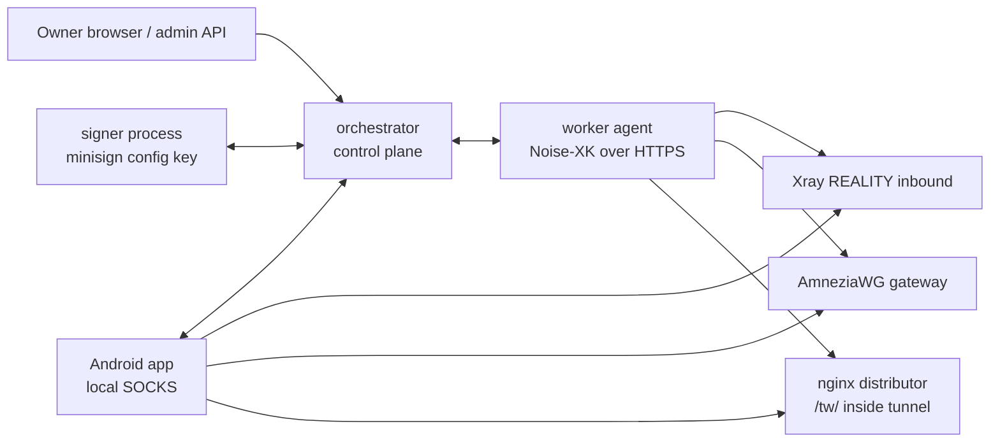
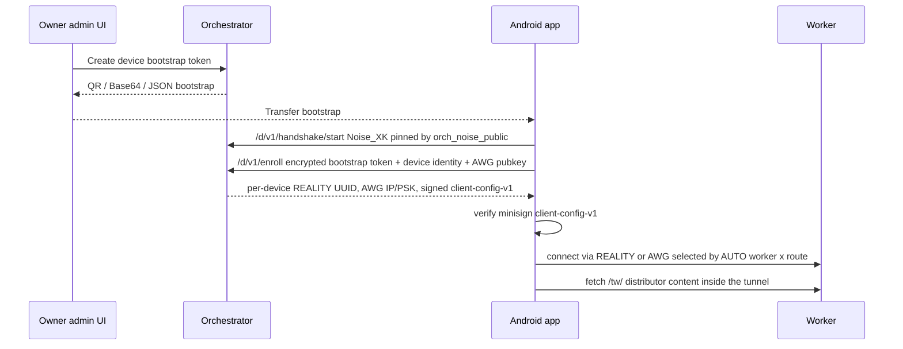

# Архитектура TrafficWrapper

[English](ARCHITECTURE.md)

Этот документ описывает публичную self-hosted платформу TrafficWrapper.
Репозиторий orchestrator является канонической точкой входа; репозитории worker
и app содержат компонентные заметки со ссылками сюда.

## Компоненты

- `orchestrator/cmd/orchestrator/main.go` владеет HTTP API, admin UI,
  approve workers, device enrollment, генерацией bundles и APK publication
  metadata.
- `orchestrator/cmd/orchestrator/signer.go` изолирует minisign-ключ подписи
  config за `ORCH_SIGNER_SOCKET`.
- `orchestrator/internal/protocol/protocol.go` определяет Noise envelope:
  prologue `TrafficWrapper orchestrator worker v1`, Noise_XK, DH25519,
  ChaChaPoly, SHA256 и framed encrypted JSON.
- `worker/agent/cmd/agent/orch_client.go` выполняет enroll, config pull,
  long-poll nudges, acknowledgements применённого состояния и forwarding
  telemetry.
- `worker/agent/cmd/agent/materialize.go` превращает approved devices в
  per-device Xray REALITY clients и AmneziaWG peers.
- `worker/core/transport/public_platform.go` и `app/core/transport` содержат
  общие public-platform transport helpers, используемые кодом worker/app.
- `app/client/app/src/main/java/...` импортирует bootstrap payloads, проверяет
  signed client config, запускает local SOCKS routing и выбирает worker по
  route.

## Доверие и bundles

Orchestrator создаёт два signed bundles из одного owner-controlled состояния:

- `worker-config-v1` приватен для workers. Он содержит desired state, например
  approved devices, per-device REALITY UUIDs, AWG public keys, internal IPs и
  update metadata, нужные worker agent.
- `client-config-v1` публичен для enrolled devices. Он содержит approved active
  workers, routes, transport parameters и update/distributor metadata.

Оба bundles подписываются signer process. Signer подписывает точную строку
`config_json`; consumers проверяют эту строку через minisign до parsing или
applying. Signer private key не хранится в web/admin process.

## Worker Enrollment

1. Owner создаёт одноразовый `ENROLL_TOKEN`.
2. Worker стартует с `ORCH_URL`, `ORCH_STATIC_PUBLIC_KEY`, `ENROLL_TOKEN`,
   сгенерированным worker Noise static key, сгенерированным AWG dialect и
   реальным `CAMOUFLAGE_DOMAIN`.
3. Worker открывает `/w/v1/handshake/start`, pin'ит orchestrator static Noise
   key и завершает Noise_XK over HTTPS.
4. Encrypted `/w/v1/enroll` request отправляет token, worker static public key и
   self-description.
5. Orchestrator записывает worker как pending. Owner approve'ит его в admin UI
   или API.
6. После approval `/w/v1/config/pull` возвращает signed worker/client bundles.
   Worker проверяет minisign, материализует локальное Xray/AWG state и
   отправляет `/w/v1/ack`.

## Device Enrollment and Connect

Первичный bootstrap одноразовый и заранее approved owner'ом. App подтверждает
распарсенные `orchestrator_url` и `config_pubkey_pin` перед enrollment. После
enrollment app проверяет signed `client-config-v1`, создаёт per-device
REALITY/AWG credentials, запускает local SOCKS front-end и автоматически probe'ит
worker x route candidates. Active route выбирается по observed health и policy;
AWG остаётся fallback path, когда REALITY unhealthy.

## Distributor and Updates

Workers открывают nginx distributor только внутри tunnel по `/tw/`. Он отдаёт
client config, APK update artifacts и telemetry forwarding paths для enrolled
clients. Public clearnet distribution намеренно не используется, чтобы
deployment metadata не рекламировались generic web endpoint'ом.

APK trust отделён от config trust:

- Android проверяет APK package signatures по pinned signing certificate
  fingerprint.
- App проверяет update manifests через deployment update minisign public key.
- Client config проверяется config-signing minisign key, pinned через
  bootstrap/enrollment.

## Production Notes

Каждый deployment должен генерировать уникальные worker state, AWG dialects,
Noise static keys, config-signing keys, update keys и camouflage values. Public
examples вроде `example.com` или seed update keys предназначены только для local
demos.
