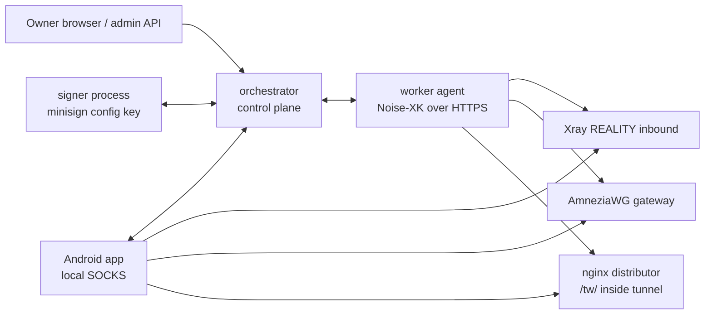
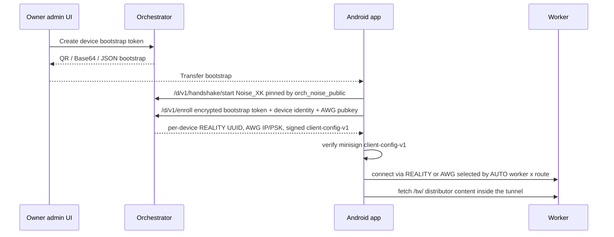

# Архитектура TrafficWrapper

[English](ARCHITECTURE.md)

Этот документ описывает публичную self-hosted платформу TrafficWrapper.
Репозиторий orchestrator является канонической точкой входа; репозитории worker
и app содержат компонентные заметки со ссылками сюда.

## Компоненты

```mermaid
flowchart LR
  Owner[Owner browser / admin API] --> ORCH[orchestrator\ncontrol plane]
  Signer[signer process\nminisign config key] <--> ORCH
  ORCH <--> WorkerAgent[worker agent\nNoise-XK over HTTPS]
  WorkerAgent --> Xray[Xray REALITY inbound]
  WorkerAgent --> AWG[AmneziaWG gateway]
  WorkerAgent --> Dist[nginx distributor\n/tw/ inside tunnel]
  Android[Android app\nlocal SOCKS] <--> ORCH
  Android --> Xray
  Android --> AWG
  Android --> Dist
```

- `orchestrator/cmd/orchestrator/` содержит control plane, разбитый по темам:
  `main.go` (конфиг, команды), `serve.go` (HTTP-сервер и маршруты),
  `noise_transport.go` (Noise handshake и envelope), `worker_api.go` и
  `device_api.go` (enroll/pull/ack), `bundles.go` (подписанные worker/client
  config), `telemetry.go`, `admin_auth.go` и `admin_api.go` (admin UI/API),
  `apk_release.go` (публикация APK), `store.go` (состояние bbolt), `cli.go`.
- `orchestrator/cmd/orchestrator/signer.go` изолирует minisign-ключ подписи
  config за `ORCH_SIGNER_SOCKET`.
- `orchestrator/internal/protocol/protocol.go` определяет Noise envelope:
  prologue `TrafficWrapper orchestrator worker v1`, Noise_XK, DH25519,
  ChaChaPoly, SHA256 и framed encrypted JSON.
- `worker/agent/cmd/agent/orch_client.go` выполняет enroll, config pull,
  long-poll nudges, acknowledgements применённого состояния и forwarding
  telemetry.
- `worker/agent/cmd/agent/materialize.go` превращает approved devices в
  per-device Xray REALITY clients и AmneziaWG peers.
- `worker/core/transport/public_platform.go` и `app/core/transport` содержат
  общие public-platform transport helpers, используемые кодом worker/app.
- `app/client/app/src/main/java/...` импортирует bootstrap payloads, проверяет
  signed client config, запускает local SOCKS routing и выбирает worker по
  route.

## Доверие и bundles

Orchestrator создаёт два signed bundles из одного owner-controlled состояния:

- `worker-config-v1` приватен для workers. Он содержит desired state, например
  approved devices, per-device REALITY UUIDs, AWG public keys, internal IPs и
  update metadata, нужные worker agent.
- `client-config-v1` публичен для enrolled devices. Он содержит approved active
  workers, routes, transport parameters и update/distributor metadata.

Оба bundles подписываются signer process. Signer подписывает точную строку
`config_json`; consumers проверяют эту строку через minisign до parsing или
applying. Signer private key не хранится в web/admin process.

## Worker Enrollment

1. Owner создаёт одноразовый `ENROLL_TOKEN`.
2. Worker стартует с `ORCH_URL`, `ORCH_STATIC_PUBLIC_KEY`, `ENROLL_TOKEN`,
   сгенерированным worker Noise static key, сгенерированным AWG dialect и
   реальным `CAMOUFLAGE_DOMAIN`.
3. Worker открывает `/w/v1/handshake/start`, pin'ит orchestrator static Noise
   key и завершает Noise_XK over HTTPS.
4. Encrypted `/w/v1/enroll` request отправляет token, worker static public key и
   self-description.
5. Orchestrator записывает worker как pending. Owner approve'ит его в admin UI
   или API.
6. После approval `/w/v1/config/pull` возвращает signed worker/client bundles.
   Worker проверяет minisign, материализует локальное Xray/AWG state и
   отправляет `/w/v1/ack`.

## Контракт self_describe воркера

Полный сетевой контракт воркер ↔ оркестратор (capabilities, статусы и коды,
`desired_state`, доставка APK и discovery) — в [CONTRACT.ru.md](CONTRACT.ru.md).

Всё, что воркер присылает в `self_describe`, недоверенное. Описание
санитизируется один раз при приёме (enroll, nudge, ack), и хранится только
очищенная копия:

- Разрешённые ключи верхнего уровня: `schema`, `hostname`, `egress_ip`,
  `orch_url`, `agent_url`, `distributor_url`, `standalone`, `dialect_id`,
  `capacity`, `protocols`, `reality`, `reality_profiles`, `awg`,
  `awg_profiles`, `health`, `orchestrator`, `distributed_apk`,
  `capabilities`. Неизвестные ключи отбрасываются, воркер не отвергается.
  `priority`, `weight`, `label` и `region` задаёт только оператор (по
  умолчанию 10/100).
- Лимиты: строки до 256 байт, до 32 профилей в списке, всего 64 КиБ (больший
  отчёт игнорируется, действует предыдущий).
- REALITY-ключи — 32 байта в base64 (RawURL или с паддингом), AWG-ключи — 32
  байта в стандартном base64, порты 1..65535, адреса — hostname или IP.
  Некорректное поле сохраняется и поднимает алерт, маршрут молча не пропадает.
- Ключ, похожий на секрет (`private_key`, `psk2`, `internal_ip`, ...), на любой
  глубине вырезается, а воркер исключается из клиентских бандлов и discovery,
  пока не пришлёт чистое описание; остальные воркеры не страдают. Клиентский
  бандл проверяется по каждому воркеру отдельно; маршруты без `type`,
  `address` и `port` и поля `discovery_url(s)` не публикуются.
- AWG-профили для учёток устройств — объединение по одобренным включённым
  воркерам; для каждого профиля побеждает подсеть большинства. Воркер с другой
  подсетью (или не приватным пулом /16../26) не отдаёт AWG клиентам и
  поднимает алерт.
- Бюджет хендшейков. Анонимные хендшейки делят pending-пул по адресу (/32,
  IPv6 /64) и по сети (/24, IPv6 /56). После любого аутентифицированного
  вызова `/w/` одобренный worker получает `cookie` в (открытом) ответе
  Noise-конверта: `v1.<worker_id>.<expiry_unix>.<mac>`, срок — 1 час. Если
  вернуть его как `cookie` в теле следующего `POST /w/v1/handshake/start`,
  хендшейк попадает в зарезервированный пул воркеров (лимиты на воркер), и
  флуд из многих сетей не отрежет воркеры. Воркеры, которые его не шлют,
  остаются в общем пуле. Cookie ничего не аутентифицирует — это делает сам
  Noise-хендшейк. До аутентификации сервер также ограничивает число
  соединений (8192), размер заголовков (64 КиБ) и одновременную буферизацию
  тел запросов (512).
- Seq клиентского бандла. Общий клиентский бандл (одинаковый для enroll и
  pull) публикуется с персистентным строго растущим seq: один seq — всегда
  одно содержимое (переподписываются только `issued_at`/`expires_at`, не чаще
  раза в минуту). Изменение содержимого публикуется под seq+1 после двух
  одинаковых проверок с интервалом 5 с (действия оператора — на следующей
  проверке); содержимое старше 2/3 `ORCH_CLIENT_BUNDLE_TTL` переиздаётся под
  seq+1. При каждой публикации seq конфига воркеров поднимается не ниже
  client seq. `workers` — всегда массив; enroll без доступного воркера
  завершается ретраимой ошибкой «no approved worker» до траты токена. Воркер
  может сообщать `client_applied_seq` в ack.
- Коды отказов и время платформы. Отказы сохраняют прежние тексты error
  (по ним сверяются старые приложения и воркеры) и получают `code`: в
  `/d/v1/enroll` — token_invalid, device_not_approved, device_revoked,
  identity_mismatch, noise_mismatch, awg_key_mismatch, awg_key_in_use,
  no_worker, retry; в
  `/w/v1/telemetry` — stale_timestamp, replay, bad_signature,
  unknown_device, device_not_approved, invalid_payload, worker_revoked,
  worker_pending. Каждый Noise-ответ воркеру содержит `server_time` (часы
  оркестратора, unix ms). Ответ enroll всегда содержит `reality_flow`, в том
  числе пустой.

## Device Enrollment and Connect

```mermaid
sequenceDiagram
  participant Owner as Owner admin UI
  participant O as Orchestrator
  participant A as Android app
  participant W as Worker
  Owner->>O: Create device bootstrap token
  O-->>Owner: QR / Base64 / JSON bootstrap
  Owner-->>A: Transfer bootstrap
  A->>O: /d/v1/handshake/start Noise_XK pinned by orch_noise_public
  A->>O: /d/v1/enroll encrypted bootstrap token + device identity + AWG pubkey
  O-->>A: per-device REALITY UUID, AWG IP/PSK, signed client-config-v1
  A->>A: verify minisign client-config-v1
  A->>W: connect via REALITY or AWG selected by AUTO worker x route
  A->>W: fetch /tw/ distributor content inside the tunnel
```

Первичный bootstrap одноразовый и заранее approved owner'ом. App подтверждает
распарсенные `orchestrator_url` и `config_pubkey_pin` перед enrollment. После
enrollment app проверяет signed `client-config-v1`, создаёт per-device
REALITY/AWG credentials, запускает local SOCKS front-end и автоматически probe'ит
worker x route candidates. Active route выбирается по observed health и policy;
AWG остаётся fallback path, когда REALITY unhealthy.

## REALITY Vision, когорты short ID и ротация AWG

- **Vision (на устройство).** Приложение передаёт в `/d/v1/enroll`
  `client_capabilities: ["reality_vision", ...]` (синоним `capabilities`); оркестратор сохраняет для устройства
  `reality_flow = "xtls-rprx-vision"`, возвращает его в ответе enroll и
  отправляет воркерам в `desired_state.approved_devices[].reality_flow`.
  Повторный enroll без capability его снимает. Общий клиентский бандл flow не
  содержит: приложение должно применять `reality_flow` из ответа enroll к TCP
  REALITY маршрутам (XHTTP flow не использует), иначе Xray отвергнет клиента.
- **Когорты short ID.** Воркеры публикуют `reality.cohort_short_ids`; REALITY
  маршруты бандла несут этот список (и в `params`), отозванные слоты заменены на
  `""`, позиции не сдвигаются. Приложение берёт слот
  `uint32be(sha256(device_id)[0:4]) % len(list)`, а при пустом слоте —
  `short_id`. `POST /admin/v1/workers/short-id {id, short_id, revoked}`
  заполняет `desired_state.revoked_short_ids`. В списке устройств админки виден
  слот `reality_cohort`.
- **Альтернативные маршруты.** Каждый воркер публикует один основной
  REALITY-маршрут (legacy-объект плюс `address_v6` базового профиля) и один
  основной AWG-маршрут (базовый профиль), так что приложения 0.1.28–0.1.31
  видят те же слоты, что и раньше. Остальные REALITY-профили вложены в
  `params.reality_profiles[]` основного маршрута (name, network, port,
  address, address_v6, server_name, public_key, short_id, flows, vision,
  xhttp), остальные AWG-профили — в `params.awg_profiles[]` (profile, port,
  endpoint, endpoint_v6, public_key, dialect, dialect_id, dns,
  min_version_code). `vision` = true, только если воркер объявил
  `reality_flow` или в `flows` профиля есть `xtls-rprx-vision`, и `flows`
  всегда с ним согласованы. Fingerprint — политика оркестратора
  (`REALITY_FP_DEFAULT`); при `REALITY_FP_MODERN`/`REALITY_FP_MODERN_MIN_VC`
  маршруты несут также `fingerprint_modern` и
  `fingerprint_modern_min_version_code`. Коды версий — производные от
  versionName (major*10000+minor*100+patch, 0.1.31 → 131), а не Android
  versionCode. `xhttp.host` передаётся, если отличается от server name.
  `ORCH_REALITY_FALLBACK_PROFILES` больше не используется.
- **Ротация диалекта AWG.** `POST /admin/v1/workers/awg-drain {id, profile,
  draining}` перестаёт отдавать клиентам AWG-профиль, клиенты переходят на
  другой профиль воркера, после чего старый можно удалить. У каждого
  одобренного устройства есть учётные данные для объединения AWG-профилей
  флота; фоновый проход досоздаёт их для нового профиля и повышает конфиг
  воркеров. Drain базового профиля `awg` отклоняется (409), пока есть
  одобренные устройства без `route_alternatives_v1`; `force: true`
  пропускает его со step-up (`current_secret`, `totp_code`) и пишется в
  аудит. Воркер, у которого база задренирована раньше, сохраняет прежнее
  поведение (с алертом) до снятия drain оператором. Ротация базового
  диалекта для старых app требует нового ключа или подсети самого базового
  профиля.
- **Capabilities клиента.** Enrollment оставляет только известные значения
  `client_capabilities` (`reality_vision`, `reality_profiles`,
  `reality_short_id`, `awg_dialect_wide`, `ipv6_endpoints`, `tunnel_dns`,
  `route_alternatives_v1`, `reality_flow_ack`; читаются не более 32 значений
  до 64 байт), остальные молча отбрасывает. Для диагностики хранится
  `client_version_code` приложения (присланный или вычисленный из
  `client_version`). Приложение с `reality_flow_ack` включает Vision в две
  фазы: ответ сохраняет активный `reality_flow` и добавляет
  `reality_flow_pending`; учётка переключается при следующем enrollment с
  `reality_flow_ack`, равным ему. Выключение Vision — сразу. Повторное
  включение в течение 10 минут после прошлой смены оставляет прежний flow без
  ошибки. Short ID хранятся и сравниваются в нижнем регистре; базовый short
  ID и последнюю когорту отозвать нельзя.
- **Здоровье и лимиты.** `self_check` из ack (`ok` / `degraded: ...`) и
  `health` из self-describe видны в админке/API; бот присылает алерт о
  degraded-воркере. Лимиты устройства для воркера содержат
  `download_mbps`/`upload_mbps` (целые Мбит/с с округлением вверх, максимум
  100000; воркер ограничивает только AWG), вычисленные из текстового лимита
  (`20mbit`, `1gbit`).

## Distributor and Updates

Workers открывают nginx distributor только внутри tunnel по `/tw/`. Он отдаёт
client config, APK update artifacts и telemetry forwarding paths для enrolled
clients. Public clearnet distribution намеренно не используется, чтобы
deployment metadata не рекламировались generic web endpoint'ом.

Доставка APK воркерам отделена от config pull. Воркер, указавший
`apk_fetch_v1` в `worker_capabilities` запроса pull, получает `update_ref`
(`apk_seq`, `apk_name`, `apk_sha256`, `apk_size`, `manifest_json`,
`manifest_minisig`) вместо inline `update` и качает APK через Noise
`POST /w/v1/apk/chunk` (`{worker_id, apk_seq, apk_sha256, offset,
length ≤ 4 MiB}` → `{ok, total_size, data_base64}`; коды
`release_superseded`, `bad_range`, `worker_revoked`). Перевыпущенный манифест
сохраняет sha256, поэтому загрузка, начатая под старым seq, продолжается.
Остальным воркерам APK идёт inline только до `ORCH_APK_INLINE_MAX_BYTES`,
иначе поля `update` в pull нет. Воркер, который после inline-попыток того же
APK снова тянет pull с тем же `have_seq`, получает только конфиг, с растущим
backoff и алертом. Релиз считается применённым, если `distributed_apk`
воркера сообщает тот же sha256 и `seq`, иначе — по legacy-маркеру ack; pull
без APK сбрасывает маркер отправки. У ответов с APK есть дедлайн записи, у
воркера не больше одного inline-слота. Живость воркеров считается от старта
оркестратора: рестарт не переводит их в inactive и не шлёт алерты.

APK trust отделён от config trust:

- Android проверяет APK package signatures по pinned signing certificate
  fingerprint.
- App проверяет update manifests через deployment update minisign public key.
- Client config проверяется config-signing minisign key, pinned через
  bootstrap/enrollment.

## Production Notes

Каждый deployment должен генерировать уникальные worker state, AWG dialects,
Noise static keys, config-signing keys, update keys и camouflage values. Public
examples вроде `example.com` или seed update keys предназначены только для local
demos.
