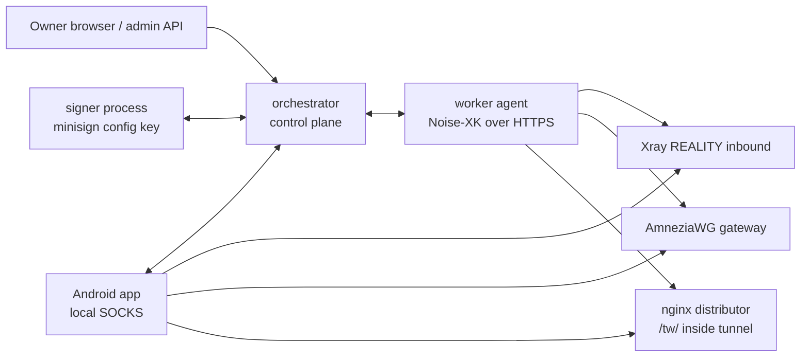
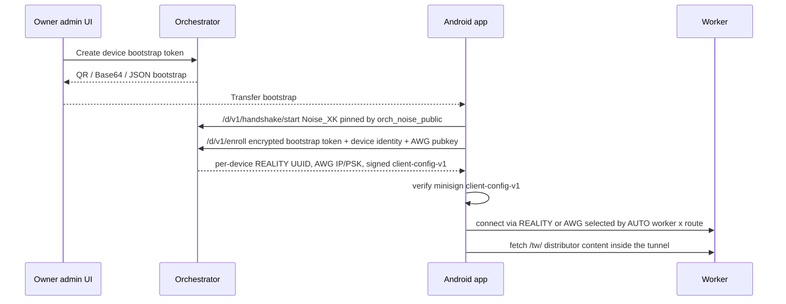

# Архитектура TrafficWrapper

[English](ARCHITECTURE.md)

Этот документ описывает публичную self-hosted платформу TrafficWrapper.
Репозиторий orchestrator является канонической точкой входа; репозитории worker
и app содержат компонентные заметки со ссылками сюда.

## Компоненты

```mermaid
flowchart LR
  Owner[Owner browser / admin API] --> ORCH[orchestrator\ncontrol plane]
  Signer[signer process\nminisign config key] <--> ORCH
  ORCH <--> WorkerAgent[worker agent\nNoise-XK over HTTPS]
  WorkerAgent --> Xray[Xray REALITY inbound]
  WorkerAgent --> AWG[AmneziaWG gateway]
  WorkerAgent --> Dist[nginx distributor\n/tw/ inside tunnel]
  Android[Android app\nlocal SOCKS] <--> ORCH
  Android --> Xray
  Android --> AWG
  Android --> Dist
```

- `orchestrator/cmd/orchestrator/` содержит control plane, разбитый по темам:
  `main.go` (конфиг, команды), `serve.go` (HTTP-сервер и маршруты),
  `noise_transport.go` (Noise handshake и envelope), `worker_api.go` и
  `device_api.go` (enroll/pull/ack), `bundles.go` (подписанные worker/client
  config), `telemetry.go`, `admin_auth.go` и `admin_api.go` (admin UI/API),
  `apk_release.go` (публикация APK), `store.go` (состояние bbolt), `cli.go`.
- `orchestrator/cmd/orchestrator/signer.go` изолирует minisign-ключ подписи
  config за `ORCH_SIGNER_SOCKET`.
- `orchestrator/internal/protocol/protocol.go` определяет Noise envelope:
  prologue `TrafficWrapper orchestrator worker v1`, Noise_XK, DH25519,
  ChaChaPoly, SHA256 и framed encrypted JSON.
- `worker/agent/cmd/agent/orch_client.go` выполняет enroll, config pull,
  long-poll nudges, acknowledgements применённого состояния и forwarding
  telemetry.
- `worker/agent/cmd/agent/materialize.go` превращает approved devices в
  per-device Xray REALITY clients и AmneziaWG peers.
- `worker/core/transport/public_platform.go` и `app/core/transport` содержат
  общие public-platform transport helpers, используемые кодом worker/app.
- `app/client/app/src/main/java/...` импортирует bootstrap payloads, проверяет
  signed client config, запускает local SOCKS routing и выбирает worker по
  route.

## Доверие и bundles

Orchestrator создаёт два signed bundles из одного owner-controlled состояния:

- `worker-config-v1` приватен для workers. Он содержит desired state, например
  approved devices, per-device REALITY UUIDs, AWG public keys, internal IPs и
  update metadata, нужные worker agent.
- `client-config-v1` публичен для enrolled devices. Он содержит approved active
  workers, routes, transport parameters и update/distributor metadata.

Оба bundles подписываются signer process. Signer подписывает точную строку
`config_json`; consumers проверяют эту строку через minisign до parsing или
applying. Signer private key не хранится в web/admin process.

## Worker Enrollment

1. Owner создаёт одноразовый `ENROLL_TOKEN`.
2. Worker стартует с `ORCH_URL`, `ORCH_STATIC_PUBLIC_KEY`, `ENROLL_TOKEN`,
   сгенерированным worker Noise static key, сгенерированным AWG dialect и
   реальным `CAMOUFLAGE_DOMAIN`.
3. Worker открывает `/w/v1/handshake/start`, pin'ит orchestrator static Noise
   key и завершает Noise_XK over HTTPS.
4. Encrypted `/w/v1/enroll` request отправляет token, worker static public key и
   self-description.
5. Orchestrator записывает worker как pending. Owner approve'ит его в admin UI
   или API.
6. После approval `/w/v1/config/pull` возвращает signed worker/client bundles.
   Worker проверяет minisign, материализует локальное Xray/AWG state и
   отправляет `/w/v1/ack`.

## Device Enrollment and Connect

```mermaid
sequenceDiagram
  participant Owner as Owner admin UI
  participant O as Orchestrator
  participant A as Android app
  participant W as Worker
  Owner->>O: Create device bootstrap token
  O-->>Owner: QR / Base64 / JSON bootstrap
  Owner-->>A: Transfer bootstrap
  A->>O: /d/v1/handshake/start Noise_XK pinned by orch_noise_public
  A->>O: /d/v1/enroll encrypted bootstrap token + device identity + AWG pubkey
  O-->>A: per-device REALITY UUID, AWG IP/PSK, signed client-config-v1
  A->>A: verify minisign client-config-v1
  A->>W: connect via REALITY or AWG selected by AUTO worker x route
  A->>W: fetch /tw/ distributor content inside the tunnel
```

Первичный bootstrap одноразовый и заранее approved owner'ом. App подтверждает
распарсенные `orchestrator_url` и `config_pubkey_pin` перед enrollment. После
enrollment app проверяет signed `client-config-v1`, создаёт per-device
REALITY/AWG credentials, запускает local SOCKS front-end и автоматически probe'ит
worker x route candidates. Active route выбирается по observed health и policy;
AWG остаётся fallback path, когда REALITY unhealthy.

## REALITY Vision, когорты short ID и ротация AWG

- **Vision (на устройство).** Приложение передаёт в `/d/v1/enroll`
  `client_capabilities: ["reality_vision", ...]` (синоним `capabilities`); оркестратор сохраняет для устройства
  `reality_flow = "xtls-rprx-vision"`, возвращает его в ответе enroll и
  отправляет воркерам в `desired_state.approved_devices[].reality_flow`.
  Повторный enroll без capability его снимает. Общий клиентский бандл flow не
  содержит: приложение должно применять `reality_flow` из ответа enroll к TCP
  REALITY маршрутам (XHTTP flow не использует), иначе Xray отвергнет клиента.
- **Когорты short ID.** Воркеры публикуют `reality.cohort_short_ids`; REALITY
  маршруты бандла несут этот список (и в `params`), отозванные слоты заменены на
  `""`, позиции не сдвигаются. Приложение берёт слот
  `uint32be(sha256(device_id)[0:4]) % len(list)`, а при пустом слоте —
  `short_id`. `POST /admin/v1/workers/short-id {id, short_id, revoked}`
  заполняет `desired_state.revoked_short_ids`. В списке устройств админки виден
  слот `reality_cohort`.
- **Fallback-профили.** При `ORCH_REALITY_FALLBACK_PROFILES=1` остальные
  `reality_profiles` (XHTTP или TCP на другом порту) добавляются доп. REALITY
  маршрутами сразу после основного маршрута воркера. Flow не передаётся; у
  каждого REALITY маршрута есть `vision` (true, если в `flows` профиля есть
  `xtls-rprx-vision`), и приложение ставит свой `reality_flow` только туда. По умолчанию выключено: приложение заполняет
  только два REALITY слота, и fallback вытесняет REALITY второго воркера.
- **Ротация диалекта AWG.** `POST /admin/v1/workers/awg-drain {id, profile,
  draining}` перестаёт отдавать клиентам AWG-профиль (учётные данные для всех
  профилей у устройств остаются), клиенты переходят на другой профиль воркера,
  после чего старый можно удалить.
- **Здоровье и лимиты.** `self_check` из ack (`ok` / `degraded: ...`) и
  `health` из self-describe видны в админке/API; бот присылает алерт о
  degraded-воркере. Лимиты устройства для воркера содержат
  `download_mbps`/`upload_mbps` (целые Мбит/с с округлением вверх, максимум
  100000; воркер ограничивает только AWG), вычисленные из текстового лимита
  (`20mbit`, `1gbit`). Маршруты AWG-профилей наследуют `endpoint_v6` и
  туннельный `dns` воркера.

## Distributor and Updates

Workers открывают nginx distributor только внутри tunnel по `/tw/`. Он отдаёт
client config, APK update artifacts и telemetry forwarding paths для enrolled
clients. Public clearnet distribution намеренно не используется, чтобы
deployment metadata не рекламировались generic web endpoint'ом.

APK trust отделён от config trust:

- Android проверяет APK package signatures по pinned signing certificate
  fingerprint.
- App проверяет update manifests через deployment update minisign public key.
- Client config проверяется config-signing minisign key, pinned через
  bootstrap/enrollment.

## Production Notes

Каждый deployment должен генерировать уникальные worker state, AWG dialects,
Noise static keys, config-signing keys, update keys и camouflage values. Public
examples вроде `example.com` или seed update keys предназначены только для local
demos.
